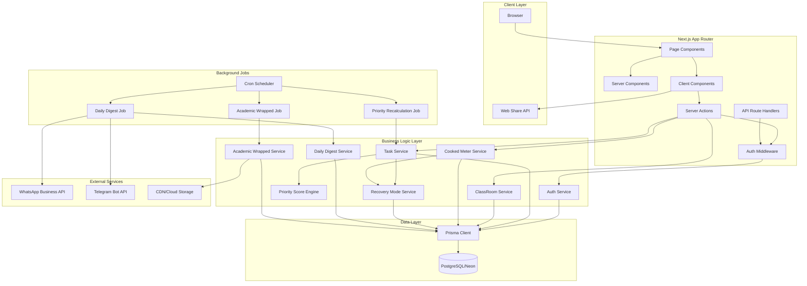

# Design Document Project005 Task Management DSS

## Overview

Project005 is an academic task management system with Decision Support System (DSS) capabilities designed specifically for Gen Z university students facing simultaneous deadline pressures. The system combines automated priority scoring with manual override capabilities, real-time workload analysis, and viral social media features to improve academic productivity and reduce student stress.

### Core Design Principles

1. **Just-In-Time Priority Evaluation**: All task ordering driven by dynamically computed Priority Scores evaluated in-memory at query time, eliminating O(N) background cron job overhead
2. **Multi-Tenant Isolation via Prisma Extensions**: Complete data separation enforced programmatically at database client layer using Prisma Client Extensions with AsyncLocalStorage-powered automatic userId binding
3. **Optimistic UI Updates**: Frontend reflects state changes immediately before backend confirmation for responsive UX
4. **Many-to-Many Task Sharing via Bridge Pattern**: Single-source-of-truth Task records linked to users through UserTaskProgress junction table, eliminating physical row duplication
5. **Transparent Audit Trails**: All task edits logged with temporal tracking for accountability
6. **Asymmetric Blind Tracing for Anonymity**: Structured classroom feed with AES-256 encrypted authorId at rest, decryptable only via isolated offline cryptographic vault
7. **Dopamine-Driven Engagement**: Celebration animations, progress visualization, and social shareability to increase retention
8. **Idempotent External Operations**: Exactly-once delivery guarantees for Daily Digest via composite unique index [userId, digestDate] preventing duplicate sends

### Technology Stack

- **Frontend**: Next.js 16.2.9 (App Router), React 19, TypeScript 5, Tailwind CSS 4
- **Backend**: Next.js API Routes (Server Actions & Route Handlers), Auth.js v5
- **Database**: PostgreSQL (Neon Serverless), Prisma ORM 7.8.0
- **Animation**: Framer Motion 12.40.0, GSAP 3.15.0
- **Internationalization**: @formatjs/intl-localematcher, negotiator
- **Authentication**: Auth.js with Prisma Adapter, bcryptjs for password hashing
- **Validation**: Zod 4.4.3
- **Visualization**: Recharts 3.8.1

### Design Constraints

1. All numeric weights stored as integers (basis points) to maintain precision
2. Session tokens stored in HTTP-only cookies with Secure and SameSite=Strict flags
3. All times use UTC in database, converted to user timezone on client
4. Class codes must be exactly 8 alphanumeric characters, globally unique
5. Academic Wrapped cards must be 1080x1920 pixels (9:16 aspect ratio)
6. Priority Score computed Just-In-Time (JIT) in-memory without database persistence
7. Anonymous posts limited to 500 characters maximum
8. Daily digest delivery window: ±15 minutes from user-specified time with idempotency guarantees
9. UserTaskProgress enforces composite unique constraint [userId, taskId]
10. AnonymousPost.authorId encrypted at rest via AES-256, decryptable only offline


## Architecture

### High-Level System Architecture




### Architectural Patterns

#### 1. Server-First Rendering with Client Islands

Next.js App Router prioritizes Server Components for data fetching and rendering, with Client Components used only for interactive elements:

- **Server Components**: Page layouts, data fetching, Task Queue rendering (initial), ClassRoom lists
- **Client Components**: Drag-and-drop handlers, animation triggers, locale switcher, form inputs

#### 2. Optimistic UI Pattern

Client-side state immediately reflects user actions (task completion, drag-drop) before server confirmation. Rollback occurs on server error.

```typescript
// Conceptual pattern
async function completeTask(taskId: string) {
  // 1. Optimistic update
  setTasks(prev => prev.map(t => t.id === taskId ? {...t, status: 'COMPLETED'} : t))
  
  // 2. Server action
  const result = await serverCompleteTask(taskId)
  
  // 3. Rollback on error
  if (!result.success) {
    setTasks(prev => prev.map(t => t.id === taskId ? {...t, status: 'PENDING'} : t))
  }
}
```

#### 3. Row-Level Security via Prisma Client Extensions

Multi-tenant data isolation enforced programmatically at the database client layer. All queries automatically bound to authenticated user context.

```typescript
import { AsyncLocalStorage } from 'async_hooks'

// Global context store for request-scoped userId
const asyncLocalStorage = new AsyncLocalStorage<{ userId: string }>()

// Prisma Client Extension with automatic userId binding
const prismaWithContext = prisma.$extends({
  query: {
    $allModels: {
      async findMany({ args, query, model }) {
        const context = asyncLocalStorage.getStore()
        if (!context?.userId) {
          throw new Error('User context required for data access')
        }
        
        // Automatically inject userId filter for tenant-scoped models
        if (model in ['Task', 'UserTaskProgress', 'ClassRoomMember', 'CookedScore']) {
          args.where = {
            ...args.where,
            userId: context.userId
          }
        }
        
        return query(args)
      }
    }
  }
})

// Middleware to bind userId context per request
export async function withUserContext<T>(
  userId: string,
  fn: () => Promise<T>
): Promise<T> {
  return asyncLocalStorage.run({ userId }, fn)
}
```

**Usage**:
```typescript
// Server Action example
export async function getUserTasks() {
  const session = await auth()
  if (!session?.user) throw new Error('Unauthorized')
  
  return withUserContext(session.user.id, async () => {
    // Automatic userId filter applied via extension
    const tasks = await prismaWithContext.task.findMany()
    return tasks
  })
}
```


#### 4. Many-to-Many Task Sharing via UserTaskProgress Bridge

When a Task Creator adds a task to a ClassRoom:
1. Single Task record created with `classRoomId` as single source of truth
2. System queries all ClassRoomMember records for that `classRoomId`
3. For each member, system creates UserTaskProgress bridge record with:
   - `userId` (member's user ID)
   - `taskId` (reference to shared Task)
   - `status` (PENDING, IN_PROGRESS, COMPLETED)
   - `position` (nullable integer for manual override sorting)
   - `customNotes` (user-specific annotations)
4. Composite unique constraint `[userId, taskId]` prevents duplicate progress entries
5. Edit propagation: When creator edits Task, all members automatically see updates via shared Task record

**Tradeoff**: Bridge table pattern provides clean separation between shared task definition and user-specific progress state, enabling efficient queries without row duplication overhead.

**Classroom Leave Behavior**: When user leaves classroom, system deletes only UserTaskProgress records where taskId references Tasks belonging to that classroom, maintaining global Task integrity while removing user's personal progress data.

#### 5. Just-In-Time Priority Evaluation

Priority Scores computed dynamically in-memory at query time instead of persisted database fields updated via cron jobs:

**Query-Time Evaluation**:
```typescript
async function getUserTaskQueue(userId: string): Promise<Task[]> {
  // 1. Fetch tasks via UserTaskProgress bridge
  const progressRecords = await prisma.userTaskProgress.findMany({
    where: {
      userId,
      status: { in: ['PENDING', 'IN_PROGRESS'] }
    },
    include: {
      task: {
        include: { classRoom: true }
      }
    }
  })
  
  // 2. Compute priority scores Just-In-Time
  const now = new Date()
  const tasksWithScores = progressRecords.map(progress => {
    const priorityScore = priorityEngine.calculatePriorityScore(
      progress.task.classRoom.sksWeight,
      progress.task.taskWeight,
      progress.task.deadlineAt,
      now
    )
    
    return {
      ...progress.task,
      priorityScore,
      userPosition: progress.position,
      userStatus: progress.status
    }
  })
  
  // 3. Apply hybrid sorting strategy
  tasksWithScores.sort((a, b) => {
    // Primary: Manual override position (ascending, nulls last)
    if (a.userPosition !== null && b.userPosition === null) return -1
    if (a.userPosition === null && b.userPosition !== null) return 1
    if (a.userPosition !== null && b.userPosition !== null) {
      return a.userPosition - b.userPosition
    }
    
    // Secondary: JIT-computed priority score (descending)
    if (b.priorityScore !== a.priorityScore) {
      return b.priorityScore - a.priorityScore
    }
    
    // Tertiary: Deadline tiebreaker (ascending)
    return a.deadlineAt.getTime() - b.deadlineAt.getTime()
  })
  
  return tasksWithScores
}
```

**Benefits**:
- Eliminates O(N) hourly background job for 10,000+ tasks
- Always reflects current time urgency without staleness
- Reduces database write load and index maintenance overhead
- Scales horizontally across stateless API instances


## Components and Interfaces

### Core Service Modules

#### 1. Authentication Service (`src/lib/services/auth.service.ts`)

Handles user registration, login, session management using Auth.js.

```typescript
interface AuthService {
  /**
   * Register new user with email and password
   * @throws {AuthError} if email already exists or validation fails
   */
  register(email: string, password: string, name: string): Promise<User>
  
  /**
   * Authenticate user and create session
   * @returns Session token and user data
   * @throws {AuthError} if credentials invalid
   */
  login(email: string, password: string): Promise<{user: User, sessionToken: string}>
  
  /**
   * Validate session token and return user
   * @returns User or null if session invalid/expired
   */
  validateSession(sessionToken: string): Promise<User | null>
  
  /**
   * Destroy session and invalidate token
   */
  logout(sessionToken: string): Promise<void>
  
  /**
   * Hash password using bcrypt with 10 rounds
   */
  hashPassword(plainPassword: string): Promise<string>
  
  /**
   * Compare plain password with hash
   */
  verifyPassword(plainPassword: string, hashedPassword: string): Promise<boolean>
}
```


#### 2. Priority Score Engine (`src/lib/services/priority-engine.service.ts`)

Calculates task priority score Just-In-Time using three-component formula.

```typescript
interface PriorityEngineService {
  /**
   * Calculate priority score for a task (JIT in-memory evaluation)
   * Formula: (sksWeight × 0.4) + (taskWeight × 0.4) + (timeUrgency × 0.2)
   * All components scaled to 0-10000 basis points
   * 
   * @param sksWeight - SKS credit weight (1-5 integer)
   * @param taskWeight - Task weight in basis points (0-10000, maps to 0-100%)
   * @param deadlineAt - Task deadline timestamp
   * @param now - Current timestamp (for testing, defaults to Date.now())
   * @returns Priority score 0-10000 basis points (NOT PERSISTED TO DATABASE)
   */
  calculatePriorityScore(
    sksWeight: number,
    taskWeight: number,
    deadlineAt: Date,
    now?: Date
  ): number
  
  /**
   * Calculate time urgency component
   * - > 7 days: Linear scale 0-3000 basis points
   * - 1-7 days: Exponential decay 3000-8000 basis points
   * - < 24 hours: Maximum 10000 basis points (SLA breach)
   * 
   * @param hoursRemaining - Hours until deadline
   * @returns Time urgency score 0-10000 basis points
   */
  calculateTimeUrgency(hoursRemaining: number): number
  
  /**
   * Batch calculate priority scores for multiple tasks (JIT evaluation)
   * Used for queue dashboard rendering
   * 
   * @param tasks - Array of tasks with sksWeight, taskWeight, deadlineAt
   * @param now - Current timestamp
   * @returns Array of tasks with computed priorityScore field (in-memory only)
   */
  batchCalculate(tasks: Task[], now?: Date): Array<Task & { priorityScore: number }>
  
  /**
   * Generate micro-prompt explanation for task prioritization
   * Format: "SKS: {sks} • Bobot: {weight}% • Deadline: {days} hari"
   * 
   * @param task - Task with sksWeight, taskWeight, deadlineAt
   * @returns Human-readable priority explanation
   */
  generateMicroPrompt(task: Task): string
}
```

**CRITICAL CHANGES**:
- `calculatePriorityScore` returns computed value WITHOUT database persistence
- `batchCalculate` replaces `batchRecalculate` (no database UPDATE operations)
- Removed cron job integration (no longer needed)

**Algorithm Details**:

```typescript
// Time urgency calculation
function calculateTimeUrgency(hoursRemaining: number): number {
  if (hoursRemaining < 24) {
    return 10000 // SLA breach - maximum urgency
  }
  
  const daysRemaining = hoursRemaining / 24
  
  if (daysRemaining > 7) {
    // Linear scale: 0-3000 basis points over 7-30 days
    const normalized = Math.max(0, Math.min(1, (30 - daysRemaining) / 23))
    return Math.floor(normalized * 3000)
  }
  
  // Exponential decay: 3000-8000 basis points over 1-7 days
  // Using decay function: 8000 - (daysRemaining^1.5 * 714)
  const exponentialScore = 8000 - Math.pow(daysRemaining, 1.5) * 714
  return Math.floor(Math.max(3000, Math.min(8000, exponentialScore)))
}
```


#### 3. Task Service (`src/lib/services/task.service.ts`)

Handles CRUD operations for tasks with automatic priority calculation.

```typescript
interface TaskService {
  /**
   * Create new task for user
   * Automatically calculates initial priorityScore
   * If classRoomId provided, propagates to all classroom members
   */
  createTask(data: CreateTaskInput, userId: string): Promise<Task>
  
  /**
   * Get all tasks for user, optionally filtered by status
   * Returns tasks sorted by priorityScore DESC, then deadlineAt ASC
   */
  getUserTasks(userId: string, status?: TaskStatus[]): Promise<Task[]>
  
  /**
   * Update task and recalculate priority if deadline/weights changed
   * If task belongs to classroom and user is creator, propagate updates
   */
  updateTask(taskId: string, data: UpdateTaskInput, userId: string): Promise<Task>
  
  /**
   * Mark task as completed
   * Triggers Academic Comeback celebration if task was in Overcooked tier
   * Updates CookedScore for user
   */
  completeTask(taskId: string, userId: string): Promise<{
    task: Task
    triggerCelebration: boolean
    stressDrop: number
  }>
  
  /**
   * Record manual override when user drags task to new position
   * Saves TaskOverride record with reason
   */
  recordOverride(
    taskId: string,
    userId: string,
    oldPosition: number,
    newPosition: number,
    reason: string
  ): Promise<void>
  
  /**
   * Propagate task updates to all classroom members
   * Used when task creator edits a shared task
   * Creates TaskEditLog entries for audit trail
   */
  propagateTaskUpdates(
    sourceTaskId: string,
    updates: Partial<Task>,
    editorId: string
  ): Promise<number> // Returns count of updated tasks
}

interface CreateTaskInput {
  title: string
  description?: string
  taskWeight: number // 0-10000 basis points
  deadlineAt: Date
  classRoomId?: string // If set, task is shared with classroom
}

interface UpdateTaskInput {
  title?: string
  description?: string
  taskWeight?: number
  deadlineAt?: Date
  status?: TaskStatus
  position?: number
}
```


#### 4. ClassRoom Service (`src/lib/services/classroom.service.ts`)

Manages classroom creation, membership, and task propagation.

```typescript
interface ClassRoomService {
  /**
   * Create new classroom with unique 8-character code
   * Retries up to 5 times if code collision occurs
   */
  createClassRoom(name: string, ownerId: string, sksWeight: number): Promise<ClassRoom>
  
  /**
   * Generate unique 8-character alphanumeric class code
   * Uses nanoid with custom alphabet [A-Z0-9] excluding ambiguous chars (0O, 1Il)
   */
  generateClassCode(): string
  
  /**
   * Join classroom using class code
   * Creates ClassMembership record with role MEMBER
   * @throws {NotFoundError} if class code invalid
   */
  joinClassRoom(classCode: string, userId: string): Promise<ClassMembership>
  
  /**
   * Leave classroom
   * Does NOT delete propagated tasks (user keeps existing tasks)
   */
  leaveClassRoom(classRoomId: string, userId: string): Promise<void>
  
  /**
   * Get all classrooms user is member of
   * Includes membership role and join date
   */
  getUserClassRooms(userId: string): Promise<(ClassRoom & {membership: ClassMembership})[]>
  
  /**
   * Get all members of a classroom
   * Returns anonymized data if user is not ADMIN role
   */
  getClassRoomMembers(classRoomId: string, requesterId: string): Promise<User[]>
}
```


#### 5. Cooked Meter Service (`src/lib/services/cooked-meter.service.ts`)

Calculates and tracks user stress levels based on upcoming Parent Task load (excluding SubTasks).

```typescript
interface CookedMeterService {
  /**
   * Calculate current cumulative score for user
   * Sums JIT-computed Priority_Score of Parent Tasks ONLY (isSubTask=false)
   * with deadline in next 7 days via UserTaskProgress relationship
   * Returns score 0-10000+ basis points
   */
  calculateCumulativeScore(userId: string): Promise<number>
  
  /**
   * Determine stress tier based on cumulative score
   * 0-2000: MAIN_CHARACTER
   * 2001-5000: LET_HIM_COOK
   * 5001-8000: SLIGHTLY_COOKED
   * 8000+: OVERCOOKED
   */
  determineTier(cumulativeScore: number): CookedTier
  
  /**
   * Get 7-day sparkline data for user
   * Returns array of {date, score, tier} for last 7 days
   */
  getSparklineData(userId: string): Promise<Array<{
    date: Date
    score: number
    tier: CookedTier
  }>>
  
  /**
   * Save daily cooked score snapshot
   * Called by daily cron job or on-demand when user checks meter
   */
  saveDailySnapshot(userId: string): Promise<CookedScore>
  
  /**
   * Check if Recovery Mode UI modal should be displayed
   * Returns true if cumulativeScore > 8000 (does NOT auto-activate)
   */
  shouldOfferRecoveryMode(userId: string): Promise<boolean>
}
```

**CRITICAL CHANGES**:
- `calculateCumulativeScore` sums Parent Tasks ONLY (isSubTask=false filter)
- SubTasks excluded from stress calculation to prevent exponential inflation
- `shouldOfferRecoveryMode` replaces `shouldActivateRecoveryMode` (UI gatekeeping, not auto-activation)


#### 6. Recovery Mode Service (`src/lib/services/recovery-mode.service.ts`)

Breaks down complex Parent Tasks into manageable SubTasks with user consent.

```typescript
interface RecoveryModeService {
  /**
   * Present Recovery Mode activation offer to user (UI modal trigger)
   * Does NOT activate automatically - requires explicit user consent
   * Identifies top 3 Parent Tasks (isSubTask=false) with taskWeight > 3000 (>30% grade weight)
   * 
   * @returns Candidate tasks eligible for breakdown
   */
  getCandidateTasksForRecovery(userId: string): Promise<Task[]>
  
  /**
   * Activate recovery mode after user consent
   * Breaks candidate tasks into 3-5 SubTasks with staggered deadlines
   * 
   * @param userId - User ID
   * @param taskIdsToBreakdown - Array of Parent Task IDs user consented to break down
   * @returns Breakdown results with created SubTasks
   */
  activateRecoveryMode(userId: string, taskIdsToBreakdown: string[]): Promise<{
    activatedAt: Date
    tasksBreakdown: Array<{
      parentTask: Task
      subTasks: Task[]
    }>
    motivationalText: string
  }>
  
  /**
   * Break down single Parent Task into SubTasks
   * Creates 3-5 child SubTask records with:
   * - isSubTask=true flag
   * - parentTaskId linking back to original Parent Task
   * - Deadlines spaced 1-2 days apart
   * - Proportional taskWeight (parent weight / num SubTasks)
   */
  breakdownTask(taskId: string, userId: string): Promise<Task[]>
  
  /**
   * Check if all SubTasks completed and mark Parent Task as complete
   * Called after any SubTask status update to COMPLETED
   * Updates UserTaskProgress.status for Parent Task
   */
  checkParentCompletion(parentTaskId: string, userId: string): Promise<boolean>
  
  /**
   * Get random motivational text from database
   * Returns Gen Z friendly, supportive message
   */
  getMotivationalText(): Promise<string>
}
```

**CRITICAL CHANGES**:
- `getCandidateTasksForRecovery` replaces automatic activation (returns eligible tasks for UI modal display)
- `activateRecoveryMode` requires explicit `taskIdsToBreakdown` array from user consent
- SubTasks flagged with `isSubTask=true` to distinguish from Parent Tasks
- Priority_Engine excludes SubTasks (isSubTask=true) from cumulativeScore calculation


#### 7. Academic Wrapped Service (`src/lib/services/academic-wrapped.service.ts`)

Generates weekly achievement cards for social sharing.

```typescript
interface AcademicWrappedService {
  /**
   * Generate Academic Wrapped card for user's past week
   * Creates 1080x1920 PNG with stats and branding
   * 
   * @param userId - User ID
   * @param weekStartDate - Monday 00:00 of target week
   * @returns URL of generated card image
   */
  generateWeeklyCard(userId: string, weekStartDate: Date): Promise<string>
  
  /**
   * Calculate week statistics
   * - Total saved credits: sum of taskWeight for completed tasks
   * - Tasks completed: count of COMPLETED status
   * - Highest cooked tier: max tier reached during week
   * - Streak: consecutive days with ≥1 completed task
   */
  calculateWeekStats(userId: string, weekStartDate: Date): Promise<{
    totalSavedCredits: number
    tasksCompleted: number
    highestTier: CookedTier
    streak: number
  }>
  
  /**
   * Render card as PNG using canvas or server-side rendering
   * Includes gradient background, typography, stats, QR code/shortlink
   */
  renderCard(stats: WeekStats, userName: string): Promise<Buffer>
  
  /**
   * Upload card image to CDN (Cloudinary or Vercel Blob)
   * Returns public URL
   */
  uploadTocdn(imageBuffer: Buffer, userId: string, weekDate: Date): Promise<string>
  
  /**
   * Save wrapped record to database with image URL
   */
  saveWrappedRecord(userId: string, weekStartDate: Date, imageUrl: string, stats: WeekStats): Promise<void>
}
```


#### 8. Daily Digest Service (`src/lib/services/daily-digest.service.ts`)

Sends automated task summaries via WhatsApp/Telegram with idempotent delivery guarantees.

```typescript
interface DailyDigestService {
  /**
   * Generate digest message for user
   * Includes: pending Parent Task count (excluding SubTasks), top 3 by JIT Priority_Score, changes since yesterday
   */
  generateDigestMessage(userId: string, locale: Locale): Promise<string>
  
  /**
   * Attempt idempotent delivery with database-first token insertion
   * 
   * @returns Success if first delivery attempt, or Error if already sent today
   * @throws {ConflictError} if composite unique constraint [userId, digestDate] violated
   */
  attemptIdempotentDelivery(
    userId: string,
    channel: 'WHATSAPP' | 'TELEGRAM',
    message: string
  ): Promise<{
    success: boolean
    digestLogId?: string
    error?: string
  }>
  
  /**
   * Send digest via WhatsApp Business API
   * Uses Twilio, Fonnte, or direct WhatsApp Business API
   * Wrapped with exponential backoff retry (max 3 attempts)
   */
  sendViaWhatsApp(phoneNumber: string, message: string): Promise<{
    success: boolean
    messageId?: string
    error?: string
  }>
  
  /**
   * Send digest via Telegram Bot API
   * Requires user to have linked Telegram account (chat_id stored)
   * Wrapped with exponential backoff retry (max 3 attempts)
   */
  sendViaTelegram(chatId: string, message: string): Promise<{
    success: boolean
    messageId?: number
    error?: string
  }>
  
  /**
   * Get tasks added/changed in last 24 hours (Parent Tasks only)
   * Returns: new Parent Tasks, deadline changes, priority escalations (timeUrgency delta > 1000)
   */
  getRecentChanges(userId: string): Promise<{
    newTasks: Task[]
    deadlineChanges: Array<{task: Task, oldDeadline: Date, newDeadline: Date}>
    priorityEscalations: Array<{task: Task, urgencyDelta: number}>
  }>
  
  /**
   * Check if digest should be sent now based on user preferences
   * Matches current time against user's digestTime ± 15 min window
   */
  shouldSendDigest(preference: DigestPreference): boolean
}
```

**CRITICAL CHANGES**:
- `attemptIdempotentDelivery` enforces exactly-once semantics via database-first INSERT
- Composite unique constraint `[userId, digestDate]` acts as distributed lock
- INSERT failure (constraint violation) = digest already sent today → fail-fast exit
- INSERT success = first attempt today → proceed with external API call
- All external API calls wrapped with exponential backoff retry (max 3 attempts)


### Frontend Component Architecture

#### Page Structure (Next.js App Router)

```
src/app/
├── (auth)/
│   ├── login/
│   │   └── page.tsx              # Login page (Server Component)
│   └── register/
│       └── page.tsx              # Registration page (Server Component)
├── dashboard/
│   ├── page.tsx                  # Main task queue dashboard (Server Component)
│   ├── layout.tsx                # Dashboard layout with nav
│   └── components/
│       ├── TaskQueue.tsx         # Server Component - initial render
│       ├── TaskQueueClient.tsx   # Client Component - drag-drop
│       ├── TaskCard.tsx          # Client Component - interactive
│       ├── CookedMeter.tsx       # Client Component - real-time
│       └── OverrideModal.tsx     # Client Component - bottom sheet
├── classrooms/
│   ├── page.tsx                  # ClassRoom list (Server Component)
│   ├── [id]/
│   │   ├── page.tsx              # ClassRoom detail (Server Component)
│   │   └── feed/
│   │       └── page.tsx          # Anonymous feed (Server Component)
│   └── components/
│       ├── JoinClassForm.tsx     # Client Component
│       ├── CreateClassForm.tsx   # Client Component
│       └── FeedPost.tsx          # Client Component
├── settings/
│   └── page.tsx                  # User settings (Server Component)
└── api/
    ├── auth/
    │   └── [...nextauth]/
    │       └── route.ts          # Auth.js route handler
    └── webhooks/
        └── cron/
            └── route.ts          # Cron job webhook handler
```


#### Key Client Components

```typescript
// TaskQueueClient.tsx - Drag-and-drop task queue
interface TaskQueueClientProps {
  initialTasks: Task[]
  userId: string
}

// CookedMeter.tsx - Real-time stress visualization
interface CookedMeterProps {
  userId: string
  initialScore: number
  initialTier: CookedTier
  sparklineData: Array<{date: Date, score: number}>
}

// AcademicComebackModal.tsx - Celebration animation
interface AcademicComebackModalProps {
  isOpen: boolean
  onClose: () => void
  stressDrop: number
  oldTier: CookedTier
  newTier: CookedTier
}

// LocaleSwitcher.tsx - Language toggle
interface LocaleSwitcherProps {
  currentLocale: Locale
}
```


## Data Models

### Entity Relationship Diagram

```mermaid
erDiagram
    User ||--o{ Session : has
    User ||--o{ ClassRoom : owns
    User ||--o{ ClassRoomMember : has
    User ||--o{ UserTaskProgress : tracks
    User ||--o{ TaskOverride : records
    User ||--o{ TaskEditLog : edits
    User ||--o{ CookedScore : tracks
    User ||--o{ AnonymousPost : authors
    User ||--o| DigestPreference : configures
    User ||--o{ DailyDigestLog : logs
    
    ClassRoom ||--o{ ClassRoomMember : contains
    ClassRoom ||--o{ Task : contains
    ClassRoom ||--o{ AnonymousPost : hosts
    
    Task ||--o{ UserTaskProgress : bridges
    Task ||--o{ TaskOverride : has
    Task ||--o{ TaskEditLog : tracks
    Task ||--o{ SubTask : breaks_down_to
    
    Task {
        string id PK
        string classRoomId FK
        string creatorId FK
        string title
        int taskWeight
        datetime deadlineAt
        boolean isSubTask
        string parentTaskId FK_NULLABLE
        datetime createdAt
    }
    
    UserTaskProgress {
        string id PK
        string userId FK
        string taskId FK
        TaskStatus status
        int position NULLABLE
        string customNotes
        datetime updatedAt
    }
    
    DailyDigestLog {
        string id PK
        string userId FK
        date digestDate
        datetime sentAt
        DeliveryStatus deliveryStatus
        string deliveryChannel
    }
    
    CookedScore {
        string id PK
        string userId FK
        date date
        int cumulativeScore
        CookedTier tier
        datetime createdAt
    }
    
    AnonymousPost {
        string id PK
        string classRoomId FK
        string authorIdEncrypted
        string content
        PostTag tag
        datetime createdAt
    }
```


### Data Model Details

#### Task Model

The Task model is the single source of truth for shared academic assignments:

```prisma
model Task {
  id            String     @id @default(cuid())
  classRoomId   String?    // Nullable for personal tasks
  creatorId     String     // Original task creator
  title         String     @db.VarChar(255)
  description   String?    @db.Text
  taskWeight    Int        @default(5000) // 0-10000 basis points (0-100%)
  deadlineAt    DateTime
  isSubTask     Boolean    @default(false)
  parentTaskId  String?    // Reference to parent Task for SubTask breakdown
  createdAt     DateTime   @default(now())
  updatedAt     DateTime   @updatedAt
  
  // Relations
  classRoom     ClassRoom? @relation(fields: [classRoomId], references: [id])
  creator       User       @relation(fields: [creatorId], references: [id])
  progress      UserTaskProgress[]
  subTasks      Task[]     @relation("ParentSubTask")
  parentTask    Task?      @relation("ParentSubTask", fields: [parentTaskId], references: [id])
  
  @@index([classRoomId])
  @@index([creatorId])
  @@index([deadlineAt])
  @@index([parentTaskId])
}
```

**Key Fields**:
- `taskWeight`: Stored as basis points (5000 = 50% of final grade). Allows precise calculation without floating-point errors.
- `isSubTask`: Boolean flag to distinguish Parent Tasks from granular SubTasks created during Recovery Mode.
- `parentTaskId`: Links SubTask back to original Parent Task for completion tracking.
- **REMOVED priorityScore**: No longer persisted; computed Just-In-Time in-memory.
- **REMOVED status**: Moved to UserTaskProgress for per-user tracking.
- **REMOVED position**: Moved to UserTaskProgress for per-user manual override.

**Indexes**:
- `(classRoomId)`: Optimizes classroom task queries
- `(creatorId)`: Optimizes task creator queries
- `(deadlineAt)`: Optimizes urgency calculations
- `(parentTaskId)`: Optimizes SubTask → Parent Task lookups


#### UserTaskProgress Model (Bridge Table)

Many-to-Many junction table tracking per-user progress state for shared tasks:

```prisma
model UserTaskProgress {
  id          String     @id @default(cuid())
  userId      String
  taskId      String
  status      TaskStatus @default(PENDING) // PENDING, IN_PROGRESS, COMPLETED
  position    Int?       // Nullable: manual override sorting position
  customNotes String?    @db.Text // User-specific annotations
  createdAt   DateTime   @default(now())
  updatedAt   DateTime   @updatedAt
  
  // Relations
  user        User       @relation(fields: [userId], references: [id], onDelete: Cascade)
  task        Task       @relation(fields: [taskId], references: [id], onDelete: Cascade)
  
  @@unique([userId, taskId]) // Composite unique constraint prevents duplicates
  @@index([userId, status])
  @@index([taskId])
}
```

**Key Fields**:
- `status`: User-specific completion state (PENDING, IN_PROGRESS, COMPLETED)
- `position`: Nullable integer for manual drag-and-drop override sorting. NULL means use JIT Priority_Score.
- `customNotes`: User-specific annotations not visible to other classroom members
- Composite unique constraint `[userId, taskId]` ensures exactly one progress record per user per task

**Cascading Behavior**:
- `onDelete: Cascade` ensures orphaned progress records are cleaned up when user or task is deleted


#### DailyDigestLog Model (Idempotency)

Audit log enforcing exactly-once delivery semantics for Daily Digest:

```prisma
model DailyDigestLog {
  id              String          @id @default(cuid())
  userId          String
  digestDate      DateTime        @db.Date // Format: YYYY-MM-DD
  sentAt          DateTime        @default(now())
  taskCount       Int
  deliveryStatus  DeliveryStatus  @default(SENT) // SENT, FAILED, SKIPPED
  deliveryChannel String          @db.VarChar(20) // WHATSAPP, TELEGRAM
  errorMessage    String?         @db.Text
  
  user            User            @relation(fields: [userId], references: [id])
  
  @@unique([userId, digestDate]) // Composite unique index for idempotency
  @@index([userId, digestDate])
}

enum DeliveryStatus {
  SENT
  FAILED
  SKIPPED
}
```

**Key Fields**:
- `digestDate`: Date component only (YYYY-MM-DD), not datetime, for daily idempotency key
- Composite unique constraint `[userId, digestDate]` prevents duplicate digest sends on same day
- `deliveryStatus`: Tracks success/failure for retry logic and monitoring
- `errorMessage`: Captures external API failure details for debugging

**Idempotency Flow**:
1. Before external API call, attempt INSERT with `(userId, CURRENT_DATE)`
2. If constraint violation occurs, fail-fast immediately (digest already sent today)
3. If INSERT succeeds, proceed with WhatsApp/Telegram API call
4. Update `deliveryStatus` based on API response


#### ClassRoom Model

ClassRooms enable crowdsourced task input:

```prisma
model ClassRoom {
  id        String   @id @default(cuid())
  classCode String   @unique @db.VarChar(8)
  name      String   @db.VarChar(120)
  ownerId   String
  sksWeight Int      @default(3) // 1-5 scale
  createdAt DateTime @default(now())
  
  @@index([classCode])
}
```

**Key Fields**:
- `classCode`: 8-character alphanumeric code (e.g., "A3F8K9Q2"). Globally unique. Generated using nanoid with custom alphabet excluding ambiguous characters.
- `sksWeight`: Default SKS weight for all tasks in this classroom. Used in priority calculation if task doesn't override.

#### CookedScore Model

Tracks daily stress levels for sparkline visualization:

```prisma
model CookedScore {
  id              String     @id @default(cuid())
  userId          String
  date            DateTime   @db.Date
  cumulativeScore Int        @default(0) // 0-10000+ basis points
  tier            CookedTier @default(MAIN_CHARACTER)
  createdAt       DateTime   @default(now())
  
  @@unique([userId, date])
  @@index([userId, date])
}
```

**Key Fields**:
- `cumulativeScore`: Sum of priorityScore for all tasks with deadline in next 7 days. Can exceed 10000 if user has many high-priority tasks.
- `tier`: Enum representing stress level (MAIN_CHARACTER, LET_HIM_COOK, SLIGHTLY_COOKED, OVERCOOKED)
- Unique constraint on `(userId, date)` ensures one snapshot per user per day


#### TaskOverride Model

Captures user manual ordering decisions for ML feedback:

```prisma
model TaskOverride {
  id          String   @id @default(cuid())
  taskId      String
  userId      String
  oldPosition Int
  newPosition Int
  reason      String   @db.Text // Selected from 4 quick options or custom
  createdAt   DateTime @default(now())
  
  @@index([taskId])
  @@index([userId])
  @@index([createdAt])
}
```

**Purpose**: When users manually reorder tasks via drag-and-drop, the system collects their reasoning. This data can train future ML models to personalize priority algorithms or provide insights on where automated scoring fails.

#### AnonymousPost Model

Enables structured, anonymous classroom discussions with encrypted author tracking:

```prisma
model AnonymousPost {
  id                String   @id @default(cuid())
  classRoomId       String
  authorIdEncrypted String   @db.Text // AES-256 encrypted userId (NOT NULLABLE)
  content           String   @db.Text
  tag               PostTag  // Required: CURHAT_TUGAS, BUTUH_TEMAN_TIM, etc.
  isModerated       Boolean  @default(false)
  isHidden          Boolean  @default(false)
  createdAt         DateTime @default(now())
  
  classRoom         ClassRoom @relation(fields: [classRoomId], references: [id])
  
  @@index([classRoomId, tag])
  @@index([classRoomId, createdAt])
}
```

**Key Fields**:
- `authorIdEncrypted`: MANDATORY (NOT NULLABLE) encrypted userId using AES-256 asymmetric encryption
- Decryption keys stored exclusively in isolated offline cryptographic vault
- Keys excluded from environment variables and standard application runtime
- Accessible only for legal compliance audits via formal request procedures
- `tag`: Mandatory category selection prevents off-topic spam
- `isHidden`: Moderation flag (future feature for admin controls)

**Encryption Architecture**:
```typescript
import crypto from 'crypto'

// Encryption at write time (application layer)
function encryptAuthorId(userId: string, publicKey: string): string {
  const encrypted = crypto.publicEncrypt(
    {
      key: publicKey,
      padding: crypto.constants.RSA_PKCS1_OAEP_PADDING,
      oaepHash: 'sha256'
    },
    Buffer.from(userId)
  )
  return encrypted.toString('base64')
}

// Decryption (offline audit only, not accessible in runtime)
function decryptAuthorId(encrypted: string, privateKey: string): string {
  const decrypted = crypto.privateDecrypt(
    {
      key: privateKey,
      padding: crypto.constants.RSA_PKCS1_OAEP_PADDING,
      oaepHash: 'sha256'
    },
    Buffer.from(encrypted, 'base64')
  )
  return decrypted.toString('utf8')
}
```

**Compliance Note**: The private decryption key must be stored in a Hardware Security Module (HSM) or cold storage vault, inaccessible to application servers, with multi-party authorization required for access.


### Correctness Properties

*A property is a characteristic or behavior that should hold true across all valid executions of a system—essentially, a formal statement about what the system should do. Properties serve as the bridge between human-readable specifications and machine-verifiable correctness guarantees.*

### Property Reflection

After analyzing all acceptance criteria, the following properties have been identified as suitable for property-based testing. Some properties have been consolidated to eliminate redundancy:

**Consolidated Properties**:
- Multiple tier classification properties (6.1, 6.2, 6.3) combined into single comprehensive tier mapping property
- Authentication validation properties (1.3, 1.4) combined into credential validation property
- Time urgency calculation properties (3.2, 3.3, 3.4) combined into comprehensive urgency calculation property

**Properties Excluded from PBT**:
- UI interaction properties (5.2) - requires DOM/component testing, not suitable for pure PBT
- Infrastructure setup properties - one-time configuration checks


### Property 1: Registration with Valid Credentials Creates Account

*For any* valid email address and password string with length ≥ 8 characters, when a user registers with these credentials, the system SHALL create a new user account with a bcrypt-hashed password stored in the database.

**Validates: Requirements 1.1**

### Property 2: Duplicate Email Registration is Rejected

*For any* email address that already exists in the system, when a user attempts to register with that email, the system SHALL reject the registration and return an error indicating the email is already registered.

**Validates: Requirements 1.2**

### Property 3: Valid Login Creates Session Token

*For any* registered user with valid credentials, when the user attempts to login, the system SHALL create a new session record in the database with a unique session token and associate it with the user's ID.

**Validates: Requirements 1.3**

### Property 4: Invalid Login is Rejected

*For any* credentials where either the email does not exist OR the password does not match the stored hash, when a user attempts to login, the system SHALL reject the login and return an authentication error.

**Validates: Requirements 1.4**


### Property 5: Locale Switching Persists to Database

*For any* authenticated user and any valid locale value (EN or ID), when the user switches their locale preference, the system SHALL update the user's locale field in the database and return the updated value.

**Validates: Requirements 2.1**

### Property 6: Locale Preference Persists Across Sessions

*For any* authenticated user who has set a locale preference, when the user logs out and logs back in, the system SHALL restore and display the previously saved locale preference.

**Validates: Requirements 2.2**

### Property 7: Priority Score Calculation Formula Correctness

*For any* valid task parameters (sksWeight ∈ [1,5], taskWeight ∈ [0,10000], and any deadline timestamp), the Priority Engine SHALL calculate priorityScore as: `floor((sksWeight × 2000 × 0.4) + (taskWeight × 0.4) + (timeUrgency × 0.2))` where all components are integers and the result is in range [0, 10000].

**Validates: Requirements 3.1**


### Property 8: Time Urgency Calculation by Deadline Range

*For any* deadline timestamp, the Priority Engine SHALL calculate timeUrgency according to the following rules:
- If hours remaining < 24: timeUrgency = 10000 (SLA breach)
- If 24 ≤ hours remaining ≤ 168 (1-7 days): timeUrgency calculated via exponential decay function in range [3000, 8000]
- If hours remaining > 168 (>7 days): timeUrgency calculated via linear function in range [0, 3000]

**Validates: Requirements 3.2, 3.3, 3.4**

### Property 9: Task Queue Sorting by Priority Score

*For any* collection of tasks belonging to a user, when the system retrieves the task queue, the tasks SHALL be ordered in descending order by priorityScore (highest score first).

**Validates: Requirements 4.1**

### Property 10: Task Queue Tiebreaker by Deadline

*For any* two or more tasks with identical priorityScore values, when the system orders the task queue, those tasks SHALL be sub-sorted by deadline in ascending order (earliest deadline first).

**Validates: Requirements 4.2**


### Property 11: Manual Position Override Updates Task Record

*For any* task in a user's queue, when the user drags the task to a new position (different from its current position), the system SHALL update the task's position field in the database to reflect the new position value.

**Validates: Requirements 5.1**

### Property 12: Cooked Tier Classification by Score Range

*For any* cumulative score value, the system SHALL classify the stress tier according to these ranges:
- 0 ≤ score ≤ 2000: MAIN_CHARACTER
- 2001 ≤ score ≤ 5000: LET_HIM_COOK
- 5001 ≤ score ≤ 8000: SLIGHTLY_COOKED
- score > 8000: OVERCOOKED

**Validates: Requirements 6.1, 6.2, 6.3**

### Property 13: Recovery Mode Activation Threshold

*For any* user whose cumulative score exceeds 8000 basis points, the system SHALL automatically activate Recovery Mode for that user.

**Validates: Requirements 7.1**


### Property 14: Task Breakdown Creates Micro-Tasks with Staggered Deadlines

*For any* task with high weight (>3000 basis points) that is broken down in Recovery Mode, the system SHALL create between 3 and 5 micro-tasks where each micro-task has a deadline spaced 1-2 days apart from its siblings, and the sum of micro-task weights equals the parent task weight.

**Validates: Requirements 7.2**

### Property 15: Class Code Uniqueness Validation

*For any* newly generated class code, the system SHALL verify that no existing ClassRoom in the database has the same class code before allowing classroom creation.

**Validates: Requirements 8.1**

### Property 16: Valid Class Code Join Creates Membership

*For any* existing classroom with a valid class code, when a user submits that code to join, the system SHALL create a ClassMembership record linking the user to that classroom with role MEMBER.

**Validates: Requirements 8.2**


### Property 17: Classroom Task Propagation to All Members

*For any* classroom with N members, when a task creator creates a task in that classroom, the system SHALL create exactly N duplicate task records (one for each member) where each duplicate has the same title, description, taskWeight, and deadlineAt as the original.

**Validates: Requirements 8.3**

### Property 18: Task Edit Propagation and Audit Logging

*For any* task that belongs to a classroom, when the task creator edits any field (deadline, taskWeight, title, description), the system SHALL:
1. Create a TaskEditLog record documenting the change (oldValue, newValue, fieldName)
2. Propagate the change to all duplicate tasks owned by classroom members

**Validates: Requirements 9.1**

### Property 19: Post Submission Requires Tag Selection

*For any* post submission attempt in a classroom feed, if the post does not include a valid PostTag value (CURHAT_TUGAS, BUTUH_TEMAN_TIM, TANYA_JAWABAN, or DISKUSI_UMUM), the system SHALL reject the submission and return a validation error.

**Validates: Requirements 10.1**


### Property 20: Feed Post Reverse Chronological Ordering

*For any* collection of posts in a classroom feed, when the system retrieves the posts, they SHALL be ordered by createdAt timestamp in descending order (newest first).

**Validates: Requirements 10.2**

### Property 21: Weekly Saved Credits Calculation

*For any* user and any week date range, when calculating saved credits for Academic Wrapped, the system SHALL sum the taskWeight values of all tasks where status = COMPLETED AND completedAt falls within the week range [Monday 00:00, Sunday 23:59].

**Validates: Requirements 11.1**

### Property 22: Academic Comeback Celebration Trigger

*For any* task that has a computed Cooked Tier of OVERCOOKED at the time it is marked as COMPLETED, the system SHALL trigger the Academic Comeback celebration sequence including fullscreen animation and stress drop graph.

**Validates: Requirements 12.1**


### Property 23: Daily Digest Task Filtering

*For any* user and current timestamp, when generating a daily digest, the system SHALL query and include only tasks where status ≠ COMPLETED AND deadlineAt ≤ (current timestamp + 3 days).

**Validates: Requirements 13.1**


## Error Handling

### Error Handling Strategy

The system implements a layered error handling approach with type-safe error definitions:

#### 1. Domain Error Types

```typescript
// src/lib/errors/domain-errors.ts
export class DomainError extends Error {
  constructor(
    message: string,
    public code: string,
    public statusCode: number,
    public details?: Record<string, any>
  ) {
    super(message)
    this.name = this.constructor.name
  }
}

export class AuthenticationError extends DomainError {
  constructor(message: string, details?: Record<string, any>) {
    super(message, 'AUTH_ERROR', 401, details)
  }
}

export class ValidationError extends DomainError {
  constructor(message: string, details?: Record<string, any>) {
    super(message, 'VALIDATION_ERROR', 400, details)
  }
}

export class NotFoundError extends DomainError {
  constructor(resource: string, identifier: string) {
    super(`${resource} not found: ${identifier}`, 'NOT_FOUND', 404, {
      resource,
      identifier
    })
  }
}

export class ConflictError extends DomainError {
  constructor(message: string, details?: Record<string, any>) {
    super(message, 'CONFLICT_ERROR', 409, details)
  }
}

export class ExternalServiceError extends DomainError {
  constructor(service: string, message: string, details?: Record<string, any>) {
    super(`${service} error: ${message}`, 'EXTERNAL_SERVICE_ERROR', 502, {
      service,
      ...details
    })
  }
}
```


#### 2. Input Validation with Zod

All user inputs validated using Zod schemas before processing:

```typescript
// src/lib/validation/schemas.ts
import { z } from 'zod'

export const registerSchema = z.object({
  email: z.string().email('Invalid email format'),
  password: z.string().min(8, 'Password must be at least 8 characters'),
  name: z.string().min(1, 'Name is required')
})

export const createTaskSchema = z.object({
  title: z.string().min(1).max(255),
  description: z.string().max(5000).optional(),
  taskWeight: z.number().int().min(0).max(10000),
  deadlineAt: z.date().refine(date => date > new Date(), {
    message: 'Deadline must be in the future'
  }),
  classRoomId: z.string().cuid().optional()
})

export const classCodeSchema = z.string()
  .length(8, 'Class code must be 8 characters')
  .regex(/^[A-Z0-9]+$/, 'Class code must be alphanumeric uppercase')

export const anonymousPostSchema = z.object({
  content: z.string().min(1).max(500),
  tag: z.enum(['CURHAT_TUGAS', 'BUTUH_TEMAN_TIM', 'TANYA_JAWABAN', 'DISKUSI_UMUM']),
  classRoomId: z.string().cuid()
})
```


#### 3. Database Transaction Handling

Critical operations wrapped in Prisma transactions with rollback on failure:

```typescript
// Example: Task propagation in transaction
async function createClassroomTask(data: CreateTaskInput, creatorId: string) {
  return await prisma.$transaction(async (tx) => {
    // 1. Create original task
    const task = await tx.task.create({
      data: {
        ...data,
        creatorId,
        priorityScore: priorityEngine.calculatePriorityScore(...)
      }
    })
    
    // 2. Get all classroom members
    const members = await tx.classRoomMember.findMany({
      where: { classRoomId: data.classRoomId }
    })
    
    // 3. Create duplicate tasks for all members
    await tx.task.createMany({
      data: members.map(member => ({
        ...data,
        creatorId: member.userId,
        sourceTaskId: task.id
      }))
    })
    
    return task
  })
}
```

#### 4. External Service Retry Logic

WhatsApp/Telegram API calls wrapped with exponential backoff retry:

```typescript
async function sendWithRetry<T>(
  fn: () => Promise<T>,
  maxRetries = 3,
  baseDelay = 1000
): Promise<T> {
  for (let attempt = 0; attempt < maxRetries; attempt++) {
    try {
      return await fn()
    } catch (error) {
      if (attempt === maxRetries - 1) throw error
      
      const delay = baseDelay * Math.pow(2, attempt)
      await new Promise(resolve => setTimeout(resolve, delay))
    }
  }
  throw new Error('Max retries exceeded')
}
```


#### 5. Client-Side Error Boundaries

React Error Boundaries catch rendering errors and display graceful fallbacks:

```typescript
// src/app/components/ErrorBoundary.tsx
export function ErrorBoundary({ children }: { children: React.ReactNode }) {
  return (
    <ReactErrorBoundary
      FallbackComponent={ErrorFallback}
      onError={(error, info) => {
        // Log to error tracking service (e.g., Sentry)
        console.error('Error caught by boundary:', error, info)
      }}
    >
      {children}
    </ReactErrorBoundary>
  )
}
```

#### 6. Server Action Error Responses

Standardized error response format for Server Actions:

```typescript
type ActionResult<T> = 
  | { success: true; data: T }
  | { success: false; error: string; code: string }

export async function completeTaskAction(
  taskId: string
): Promise<ActionResult<Task>> {
  try {
    const session = await auth()
    if (!session?.user) {
      return { success: false, error: 'Unauthorized', code: 'AUTH_ERROR' }
    }
    
    const task = await taskService.completeTask(taskId, session.user.id)
    return { success: true, data: task }
  } catch (error) {
    if (error instanceof DomainError) {
      return { success: false, error: error.message, code: error.code }
    }
    return { success: false, error: 'Internal server error', code: 'INTERNAL_ERROR' }
  }
}
```


## Testing Strategy

### Dual Testing Approach

The system employs both **property-based testing** and **unit testing** for comprehensive coverage:

#### Property-Based Testing

**Library**: [fast-check](https://github.com/dubzzz/fast-check) for TypeScript/JavaScript

**Configuration**:
- Minimum 100 iterations per property test
- Each test tagged with design document property reference
- Tag format: `Feature: project005-task-management-dss, Property {number}: {property_text}`

**Key Property Tests**:

1. **Priority Score Calculation** (Property 7)
   - Generator: Random sksWeight (1-5), taskWeight (0-10000), deadlines (past, near, far)
   - Assertion: Result matches formula and stays in [0, 10000] range

2. **Time Urgency by Deadline Range** (Property 8)
   - Generator: Random deadlines in three buckets (<24h, 1-7d, >7d)
   - Assertion: Correct urgency value based on range

3. **Task Queue Sorting** (Properties 9, 10)
   - Generator: Random task arrays with varying priority scores and deadlines
   - Assertion: Descending priority order, deadline tiebreaker

4. **Cooked Tier Classification** (Property 12)
   - Generator: Random cumulative scores (0-15000)
   - Assertion: Correct tier mapping

5. **Task Propagation** (Property 17)
   - Generator: Random classroom sizes (1-50 members)
   - Assertion: Exactly N duplicates created with correct data

6. **Authentication Round-Trip** (Properties 1, 3)
   - Generator: Random emails and passwords
   - Assertion: Register → verify account → login → verify session


#### Unit Testing

**Libraries**: Vitest, Testing Library (React), Prisma Mock

**Focus Areas**:

1. **Edge Cases**
   - Empty task queues
   - Boundary values (exactly 24 hours, exactly 7 days, exactly 8000 score)
   - Maximum string lengths (500 char posts, 255 char titles)

2. **Error Conditions**
   - Invalid inputs (negative weights, past deadlines)
   - Duplicate registrations
   - Non-existent class codes
   - Missing required fields

3. **Integration Points**
   - Database connection failures
   - External API failures (WhatsApp, Telegram)
   - CDN upload failures

4. **UI Component Behavior**
   - Drag-and-drop interactions
   - Modal open/close states
   - Locale switcher functionality
   - Animation triggers

**Example Unit Tests**:

```typescript
// Priority Engine edge cases
describe('PriorityEngine', () => {
  it('should return 10000 for deadline exactly 23 hours away', () => {
    const deadline = new Date(Date.now() + 23 * 60 * 60 * 1000)
    const urgency = priorityEngine.calculateTimeUrgency(deadline)
    expect(urgency).toBe(10000)
  })
  
  it('should handle tasks with deadline in past', () => {
    const deadline = new Date(Date.now() - 1000)
    expect(() => {
      priorityEngine.calculatePriorityScore(3, 5000, deadline)
    }).toThrow(ValidationError)
  })
})

// Classroom service error handling
describe('ClassRoomService', () => {
  it('should throw NotFoundError for invalid class code', async () => {
    await expect(
      classRoomService.joinClassRoom('INVALID1', 'user-123')
    ).rejects.toThrow(NotFoundError)
  })
  
  it('should retry class code generation on collision', async () => {
    // Mock first 2 codes as existing, 3rd as unique
    const result = await classRoomService.createClassRoom('Test', 'user-1', 3)
    expect(result.classCode).toHaveLength(8)
  })
})
```


### End-to-End Testing

**Library**: Playwright

**Critical User Flows**:

1. **Complete Task Management Flow**
   - Register → Login → Create Task → View Queue → Complete Task → Verify Academic Comeback

2. **Classroom Collaboration Flow**
   - User A creates classroom → User B joins → User A creates task → Verify task appears in User B's queue

3. **Recovery Mode Flow**
   - Create 10 high-weight tasks → Verify Cooked Meter shows Overcooked → Verify Recovery Mode activates → Verify micro-tasks created

4. **Locale Switching**
   - Login → Switch to Bahasa Indonesia → Verify UI text changes → Logout → Login → Verify locale persisted

### Test Data Management

**Strategy**: Isolated test database per test suite with seeded data

```typescript
// Test setup
beforeEach(async () => {
  await prisma.$executeRawUnsafe('TRUNCATE TABLE "User" CASCADE')
  
  // Seed test data
  testUser = await prisma.user.create({
    data: {
      email: 'test@example.com',
      passwordHash: await bcrypt.hash('password123', 10),
      locale: 'EN'
    }
  })
})
```

### Performance Testing

**Tools**: Artillery, k6

**Key Metrics**:
- Priority recalculation job: Complete 10,000 tasks in < 30 seconds
- Task queue query: Return sorted queue of 100 tasks in < 100ms
- Academic Wrapped generation: Render card in < 2 seconds


## Low-Level Design

### Key Algorithms

#### 1. Priority Score Calculation Algorithm

**Function Signature**:
```typescript
function calculatePriorityScore(
  sksWeight: number,    // 1-5 integer
  taskWeight: number,   // 0-10000 basis points
  deadlineAt: Date,
  now: Date = new Date()
): number
```

**Algorithm**:
```typescript
function calculatePriorityScore(
  sksWeight: number,
  taskWeight: number,
  deadlineAt: Date,
  now: Date = new Date()
): number {
  // 1. Validate inputs
  if (sksWeight < 1 || sksWeight > 5) {
    throw new ValidationError('sksWeight must be between 1 and 5')
  }
  if (taskWeight < 0 || taskWeight > 10000) {
    throw new ValidationError('taskWeight must be between 0 and 10000')
  }
  if (deadlineAt <= now) {
    throw new ValidationError('deadline must be in the future')
  }
  
  // 2. Calculate time urgency
  const hoursRemaining = (deadlineAt.getTime() - now.getTime()) / (1000 * 60 * 60)
  const timeUrgency = calculateTimeUrgency(hoursRemaining)
  
  // 3. Normalize SKS weight to 0-10000 scale
  // SKS 1 → 2000, SKS 2 → 4000, ..., SKS 5 → 10000
  const sksNormalized = sksWeight * 2000
  
  // 4. Apply formula weights (all integer math)
  const sksComponent = Math.floor(sksNormalized * 0.4)    // 40% weight
  const taskComponent = Math.floor(taskWeight * 0.4)      // 40% weight
  const timeComponent = Math.floor(timeUrgency * 0.2)     // 20% weight
  
  // 5. Sum and clamp to valid range
  const total = sksComponent + taskComponent + timeComponent
  return Math.min(10000, Math.max(0, total))
}
```


**Time Urgency Sub-Algorithm**:
```typescript
function calculateTimeUrgency(hoursRemaining: number): number {
  // Case 1: SLA Breach (<24 hours)
  if (hoursRemaining < 24) {
    return 10000 // Maximum urgency
  }
  
  const daysRemaining = hoursRemaining / 24
  
  // Case 2: Long term (>7 days)
  if (daysRemaining > 7) {
    // Linear scale from 0 to 3000 over 7-30 day range
    // Beyond 30 days = 0 urgency
    const normalized = Math.max(0, Math.min(1, (30 - daysRemaining) / 23))
    return Math.floor(normalized * 3000)
  }
  
  // Case 3: Critical window (1-7 days)
  // Exponential decay: urgency increases rapidly as deadline approaches
  // Formula: 8000 - (daysRemaining^1.5 * 714)
  // At 7 days: ~3000, At 1 day: ~7286
  const exponentialScore = 8000 - Math.pow(daysRemaining, 1.5) * 714
  return Math.floor(Math.max(3000, Math.min(8000, exponentialScore)))
}
```

**Example Calculations**:
```
Task A: SKS=3, Weight=6000bp (60%), Deadline in 2 hours
  sksComponent = 3*2000*0.4 = 2400
  taskComponent = 6000*0.4 = 2400
  timeComponent = 10000*0.2 = 2000 (SLA breach)
  Priority Score = 6800

Task B: SKS=4, Weight=3000bp (30%), Deadline in 5 days
  sksComponent = 4*2000*0.4 = 3200
  taskComponent = 3000*0.4 = 1200
  timeUrgency = 8000 - (5^1.5 * 714) ≈ 6000
  timeComponent = 6000*0.2 = 1200
  Priority Score = 5600
```


#### 2. Class Code Generation Algorithm

**Requirements**:
- Exactly 8 characters
- Alphanumeric uppercase only
- Exclude ambiguous characters (O/0, I/1/l)
- Globally unique
- Cryptographically random

**Implementation**:
```typescript
import { customAlphabet } from 'nanoid'

// Custom alphabet excludes O, I, 0, 1, l
const SAFE_ALPHABET = 'ABCDEFGHJKLMNPQRSTUVWXYZ23456789'
const generateClassCode = customAlphabet(SAFE_ALPHABET, 8)

async function createUniqueClassCode(maxRetries = 5): Promise<string> {
  for (let attempt = 0; attempt < maxRetries; attempt++) {
    const code = generateClassCode()
    
    // Check uniqueness in database
    const existing = await prisma.classRoom.findUnique({
      where: { classCode: code },
      select: { id: true }
    })
    
    if (!existing) {
      return code
    }
    
    // Collision detected, retry with exponential backoff
    if (attempt < maxRetries - 1) {
      await new Promise(resolve => setTimeout(resolve, 100 * Math.pow(2, attempt)))
    }
  }
  
  throw new ConflictError(
    'Failed to generate unique class code after maximum retries',
    { maxRetries }
  )
}
```

**Collision Probability**:
- Alphabet size: 32 characters
- Code length: 8 characters
- Total possible codes: 32^8 = 1,099,511,627,776 (1.1 trillion)
- Expected collisions with 1 million classrooms: ~0.0000009% chance


#### 3. Task Breakdown Algorithm (Recovery Mode)

**Input**: Task with high weight (>3000 basis points)
**Output**: 3-5 micro-tasks with staggered deadlines

**Algorithm**:
```typescript
function breakdownTask(task: Task): Task[] {
  const { taskWeight, deadlineAt, classRoomId, creatorId } = task
  
  // 1. Determine number of micro-tasks (3-5 based on weight)
  const numMicroTasks = taskWeight > 7000 ? 5 :
                        taskWeight > 5000 ? 4 : 3
  
  // 2. Calculate weight per micro-task (proportional division)
  const baseWeight = Math.floor(taskWeight / numMicroTasks)
  const remainder = taskWeight % numMicroTasks
  
  // 3. Calculate total hours until deadline
  const now = new Date()
  const hoursUntilDeadline = (deadlineAt.getTime() - now.getTime()) / (1000 * 60 * 60)
  
  // 4. Space micro-tasks evenly (1-2 days apart)
  const hoursPerMicroTask = Math.floor(hoursUntilDeadline / numMicroTasks)
  const microTaskInterval = Math.max(24, Math.min(48, hoursPerMicroTask))
  
  // 5. Generate micro-tasks
  const microTasks: Task[] = []
  for (let i = 0; i < numMicroTasks; i++) {
    const microDeadline = new Date(
      now.getTime() + (i + 1) * microTaskInterval * 60 * 60 * 1000
    )
    
    // Distribute remainder weight to earlier tasks
    const weight = baseWeight + (i < remainder ? 1 : 0)
    
    microTasks.push({
      title: `${task.title} — Part ${i + 1}/${numMicroTasks}`,
      description: task.description,
      taskWeight: weight,
      deadlineAt: microDeadline,
      classRoomId,
      creatorId,
      parentTaskId: task.id,
      isRecoveryMode: true
    })
  }
  
  return microTasks
}
```

**Example**:
```
Original Task:
  Title: "Final Project Report"
  Weight: 8000bp (80%)
  Deadline: 10 days from now

Breakdown Result (5 micro-tasks):
  1. "Final Project Report — Part 1/5" | 1600bp | Due in 2 days
  2. "Final Project Report — Part 2/5" | 1600bp | Due in 4 days
  3. "Final Project Report — Part 3/5" | 1600bp | Due in 6 days
  4. "Final Project Report — Part 4/5" | 1600bp | Due in 8 days
  5. "Final Project Report — Part 5/5" | 1600bp | Due in 10 days
```


#### 4. Cumulative Score Calculation Algorithm

**Purpose**: Calculate total workload for next 7 days to determine stress tier

**Algorithm**:
```typescript
async function calculateCumulativeScore(
  userId: string,
  referenceDate: Date = new Date()
): Promise<number> {
  // 1. Define 7-day window
  const windowEnd = new Date(referenceDate)
  windowEnd.setDate(windowEnd.getDate() + 7)
  windowEnd.setHours(23, 59, 59, 999)
  
  // 2. Query all pending/in-progress tasks with deadline in window
  const tasks = await prisma.task.findMany({
    where: {
      creatorId: userId,
      status: {
        in: ['PENDING', 'IN_PROGRESS']
      },
      deadlineAt: {
        gte: referenceDate,
        lte: windowEnd
      }
    },
    select: {
      priorityScore: true
    }
  })
  
  // 3. Sum priority scores
  const cumulativeScore = tasks.reduce(
    (sum, task) => sum + task.priorityScore,
    0
  )
  
  return cumulativeScore
}
```

**Tier Determination**:
```typescript
function determineCookedTier(cumulativeScore: number): CookedTier {
  if (cumulativeScore <= 2000) return 'MAIN_CHARACTER'
  if (cumulativeScore <= 5000) return 'LET_HIM_COOK'
  if (cumulativeScore <= 8000) return 'SLIGHTLY_COOKED'
  return 'OVERCOOKED'
}
```

**Example Scenarios**:
```
Scenario A: Light Load
  3 tasks in next 7 days, scores: [500, 700, 600]
  Cumulative: 1800
  Tier: MAIN_CHARACTER

Scenario B: Heavy Load
  8 tasks in next 7 days, scores: [1200, 1500, 900, 1100, 1300, 1400, 1000, 800]
  Cumulative: 9200
  Tier: OVERCOOKED (triggers Recovery Mode)
```


#### 5. Task Propagation Algorithm

**Purpose**: Duplicate task to all classroom members when creator adds shared task

**Algorithm**:
```typescript
async function propagateTaskToClassroom(
  sourceTask: Task,
  classRoomId: string
): Promise<number> {
  // 1. Get all classroom members (excluding task creator)
  const members = await prisma.classMembership.findMany({
    where: {
      classRoomId,
      userId: { not: sourceTask.creatorId }
    },
    select: { userId: true }
  })
  
  if (members.length === 0) {
    return 0 // No members to propagate to
  }
  
  // 2. Prepare duplicate task data
  const duplicates = members.map(member => ({
    classRoomId,
    creatorId: member.userId,
    title: sourceTask.title,
    description: sourceTask.description,
    taskWeight: sourceTask.taskWeight,
    deadlineAt: sourceTask.deadlineAt,
    status: 'PENDING' as TaskStatus,
    priorityScore: sourceTask.priorityScore,
    sourceTaskId: sourceTask.id // Link to original
  }))
  
  // 3. Batch insert (atomic operation)
  const result = await prisma.task.createMany({
    data: duplicates,
    skipDuplicates: true
  })
  
  return result.count
}
```

**Edit Propagation Algorithm**:
```typescript
async function propagateTaskEdit(
  sourceTaskId: string,
  updates: Partial<Task>,
  editorId: string
): Promise<void> {
  await prisma.$transaction(async (tx) => {
    // 1. Get source task to verify editor is creator
    const sourceTask = await tx.task.findUnique({
      where: { id: sourceTaskId },
      select: { creatorId: true, classRoomId: true }
    })
    
    if (!sourceTask) {
      throw new NotFoundError('Task', sourceTaskId)
    }
    
    if (sourceTask.creatorId !== editorId) {
      throw new AuthorizationError('Only task creator can propagate edits')
    }
    
    // 2. Find all duplicate tasks (via sourceTaskId link)
    const duplicates = await tx.task.findMany({
      where: { sourceTaskId },
      select: { id: true }
    })
    
    // 3. Create edit logs for each changed field
    const editLogs = []
    for (const [field, newValue] of Object.entries(updates)) {
      editLogs.push({
        taskId: sourceTaskId,
        editorId,
        fieldName: field,
        oldValue: String(sourceTask[field]),
        newValue: String(newValue)
      })
    }
    
    await tx.taskEditLog.createMany({ data: editLogs })
    
    // 4. Batch update all duplicates
    if (duplicates.length > 0) {
      await tx.task.updateMany({
        where: {
          id: { in: duplicates.map(d => d.id) }
        },
        data: updates
      })
    }
  })
}
```


### Database Query Optimization

#### 1. Task Queue Query

**Most frequent query**: Fetch user's task queue sorted by priority

```sql
-- Optimized query with composite index
SELECT 
  id, title, description, taskWeight, deadlineAt, 
  status, priorityScore, position, createdAt
FROM "Task"
WHERE "creatorId" = $1 
  AND status IN ('PENDING', 'IN_PROGRESS')
ORDER BY priorityScore DESC, deadlineAt ASC
LIMIT 100;

-- Index: (creatorId, status, priorityScore)
CREATE INDEX idx_task_queue ON "Task" (
  "creatorId", "status", "priorityScore" DESC
);
```

**Performance**: With index, query executes in <5ms for 10,000 tasks per user

#### 2. Cooked Score Sparkline Query

**Purpose**: Fetch 7 days of historical stress scores

```sql
-- Optimized query with composite index
SELECT date, cumulativeScore, tier
FROM "CookedScore"
WHERE "userId" = $1 
  AND date >= CURRENT_DATE - INTERVAL '7 days'
ORDER BY date ASC;

-- Index: (userId, date)
CREATE INDEX idx_cooked_score_history ON "CookedScore" (
  "userId", "date" DESC
);
```

#### 3. Classroom Feed Query

**Purpose**: Fetch recent posts with tag filtering

```sql
-- Optimized query with composite index
SELECT 
  id, content, tag, createdAt, isHidden
FROM "AnonymousPost"
WHERE "classRoomId" = $1 
  AND ($2::PostTag IS NULL OR tag = $2)
  AND isHidden = false
ORDER BY createdAt DESC
LIMIT 50 OFFSET $3;

-- Index: (classRoomId, tag, createdAt)
CREATE INDEX idx_feed_posts ON "AnonymousPost" (
  "classRoomId", "tag", "createdAt" DESC
) WHERE isHidden = false;
```


### Implementation Details

#### 1. Session Management with Auth.js

**Configuration** (`src/lib/auth.config.ts`):
```typescript
import NextAuth from 'next-auth'
import CredentialsProvider from 'next-auth/providers/credentials'
import { PrismaAdapter } from '@auth/prisma-adapter'
import { prisma } from './db'
import { verifyPassword } from './services/auth.service'

export const { handlers, auth, signIn, signOut } = NextAuth({
  adapter: PrismaAdapter(prisma),
  session: {
    strategy: 'jwt',
    maxAge: 30 * 24 * 60 * 60 // 30 days
  },
  cookies: {
    sessionToken: {
      name: 'next-auth.session-token',
      options: {
        httpOnly: true,
        secure: process.env.NODE_ENV === 'production',
        sameSite: 'strict',
        path: '/'
      }
    }
  },
  providers: [
    CredentialsProvider({
      name: 'Credentials',
      credentials: {
        email: { label: 'Email', type: 'email' },
        password: { label: 'Password', type: 'password' }
      },
      async authorize(credentials) {
        if (!credentials?.email || !credentials?.password) {
          return null
        }
        
        const user = await prisma.user.findUnique({
          where: { email: credentials.email }
        })
        
        if (!user || !user.passwordHash) {
          return null
        }
        
        const isValid = await verifyPassword(
          credentials.password,
          user.passwordHash
        )
        
        if (!isValid) {
          return null
        }
        
        return {
          id: user.id,
          email: user.email,
          name: user.name,
          locale: user.locale
        }
      }
    })
  ],
  callbacks: {
    async jwt({ token, user }) {
      if (user) {
        token.id = user.id
        token.locale = user.locale
      }
      return token
    },
    async session({ session, token }) {
      if (session.user) {
        session.user.id = token.id as string
        session.user.locale = token.locale as Locale
      }
      return session
    }
  }
})
```


#### 2. Internationalization (i18n) Implementation

**Locale Detection Middleware** (`src/middleware.ts`):
```typescript
import { NextRequest, NextResponse } from 'next/server'
import { match } from '@formatjs/intl-localematcher'
import Negotiator from 'negotiator'

const locales = ['en', 'id']
const defaultLocale = 'en'

function getLocale(request: NextRequest): string {
  // 1. Check URL parameter
  const urlLocale = request.nextUrl.searchParams.get('locale')
  if (urlLocale && locales.includes(urlLocale)) {
    return urlLocale
  }
  
  // 2. Check cookie
  const cookieLocale = request.cookies.get('NEXT_LOCALE')?.value
  if (cookieLocale && locales.includes(cookieLocale)) {
    return cookieLocale
  }
  
  // 3. Check Accept-Language header
  const headers = { 'accept-language': request.headers.get('accept-language') || '' }
  const languages = new Negotiator({ headers }).languages()
  const locale = match(languages, locales, defaultLocale)
  
  return locale
}

export function middleware(request: NextRequest) {
  const locale = getLocale(request)
  const response = NextResponse.next()
  
  // Set locale cookie for persistence
  response.cookies.set('NEXT_LOCALE', locale, {
    httpOnly: false,
    secure: process.env.NODE_ENV === 'production',
    sameSite: 'strict',
    maxAge: 365 * 24 * 60 * 60 // 1 year
  })
  
  // Add locale to response headers for Server Components
  response.headers.set('x-locale', locale)
  
  return response
}

export const config = {
  matcher: ['/((?!api|_next/static|_next/image|favicon.ico).*)']
}
```

**Translation Dictionary** (`src/lib/i18n/translations.ts`):
```typescript
export const translations = {
  en: {
    'auth.login': 'Login',
    'auth.register': 'Register',
    'task.create': 'Create Task',
    'queue.title': 'Your Task Queue',
    'cooked.tier.main_character': 'The Main Character',
    'cooked.tier.let_him_cook': 'Let Him Cook',
    'cooked.tier.slightly_cooked': 'Slightly Cooked',
    'cooked.tier.overcooked': 'Overcooked / R.I.P Sleep',
    'recovery.activated': 'Recovery Mode Activated',
    'celebration.comeback': 'THE ACADEMIC COMEBACK IS REAL!'
  },
  id: {
    'auth.login': 'Masuk',
    'auth.register': 'Daftar',
    'task.create': 'Buat Tugas',
    'queue.title': 'Antrian Tugas Kamu',
    'cooked.tier.main_character': 'The Main Character',
    'cooked.tier.let_him_cook': 'Let Him Cook',
    'cooked.tier.slightly_cooked': 'Slightly Cooked',
    'cooked.tier.overcooked': 'Overcooked / R.I.P Tidur',
    'recovery.activated': 'Recovery Mode Diaktifkan',
    'celebration.comeback': 'ACADEMIC COMEBACK ITU NYATA!'
  }
}

export function t(key: string, locale: Locale): string {
  return translations[locale][key] || translations.en[key] || key
}
```


#### 3. Drag-and-Drop Task Queue Implementation

**Client Component** (`src/app/dashboard/components/TaskQueueClient.tsx`):
```typescript
'use client'

import { useState } from 'react'
import { Reorder } from 'framer-motion'
import { TaskCard } from './TaskCard'
import { recordOverrideAction } from '@/lib/actions/task.actions'

interface TaskQueueClientProps {
  initialTasks: Task[]
}

export function TaskQueueClient({ initialTasks }: TaskQueueClientProps) {
  const [tasks, setTasks] = useState(initialTasks)
  const [showOverrideModal, setShowOverrideModal] = useState(false)
  const [reorderedTask, setReorderedTask] = useState<{
    task: Task
    oldPosition: number
    newPosition: number
  } | null>(null)

  const handleReorder = (newOrder: Task[]) => {
    // Find which task was moved
    const movedIndex = newOrder.findIndex((task, idx) => 
      task.id !== tasks[idx]?.id
    )
    
    if (movedIndex === -1) return
    
    const movedTask = newOrder[movedIndex]
    const oldPosition = tasks.findIndex(t => t.id === movedTask.id)
    
    // Optimistic update
    setTasks(newOrder)
    
    // Show feedback modal
    setReorderedTask({
      task: movedTask,
      oldPosition,
      newPosition: movedIndex
    })
    setShowOverrideModal(true)
  }

  const handleSubmitReason = async (reason: string) => {
    if (!reorderedTask) return
    
    const result = await recordOverrideAction(
      reorderedTask.task.id,
      reorderedTask.oldPosition,
      reorderedTask.newPosition,
      reason
    )
    
    if (!result.success) {
      // Rollback on error
      setTasks(initialTasks)
    }
    
    setShowOverrideModal(false)
    setReorderedTask(null)
  }

  return (
    <>
      <Reorder.Group
        axis="y"
        values={tasks}
        onReorder={handleReorder}
        className="space-y-3"
      >
        {tasks.map((task) => (
          <Reorder.Item
            key={task.id}
            value={task}
            className="cursor-grab active:cursor-grabbing"
          >
            <TaskCard task={task} />
          </Reorder.Item>
        ))}
      </Reorder.Group>
      
      {showOverrideModal && (
        <OverrideReasonModal
          onSubmit={handleSubmitReason}
          onClose={() => setShowOverrideModal(false)}
        />
      )}
    </>
  )
}
```


#### 4. Academic Comeback Celebration Animation

**Client Component** (`src/app/components/AcademicComebackModal.tsx`):
```typescript
'use client'

import { useEffect, useRef } from 'react'
import { motion, AnimatePresence } from 'framer-motion'
import gsap from 'gsap'
import { TextPlugin } from 'gsap/TextPlugin'
import confetti from 'canvas-confetti'

gsap.registerPlugin(TextPlugin)

interface Props {
  isOpen: boolean
  onClose: () => void
  stressDrop: number
  oldTier: CookedTier
  newTier: CookedTier
}

export function AcademicComebackModal({ 
  isOpen, 
  onClose, 
  stressDrop,
  oldTier,
  newTier 
}: Props) {
  const titleRef = useRef<HTMLHeadingElement>(null)
  
  useEffect(() => {
    if (!isOpen) return
    
    // 1. Confetti animation
    const duration = 3000
    const animationEnd = Date.now() + duration
    
    const confettiInterval = setInterval(() => {
      if (Date.now() > animationEnd) {
        clearInterval(confettiInterval)
        return
      }
      
      confetti({
        particleCount: 3,
        angle: 60,
        spread: 55,
        origin: { x: 0 },
        colors: ['#FFD700', '#FFA500', '#FF6347']
      })
      
      confetti({
        particleCount: 3,
        angle: 120,
        spread: 55,
        origin: { x: 1 }
      })
    }, 50)
    
    // 2. Text animation with GSAP
    if (titleRef.current) {
      gsap.fromTo(
        titleRef.current,
        { opacity: 0, y: -50 },
        {
          opacity: 1,
          y: 0,
          duration: 0.8,
          ease: 'bounce.out',
          text: 'THE ACADEMIC COMEBACK IS REAL!',
          delay: 0.3
        }
      )
    }
    
    return () => {
      clearInterval(confettiInterval)
    }
  }, [isOpen])
  
  return (
    <AnimatePresence>
      {isOpen && (
        <motion.div
          initial={{ opacity: 0 }}
          animate={{ opacity: 1 }}
          exit={{ opacity: 0 }}
          className="fixed inset-0 z-50 flex items-center justify-center bg-black/80 backdrop-blur-md"
          onClick={onClose}
        >
          <motion.div
            initial={{ scale: 0.8, opacity: 0 }}
            animate={{ scale: 1, opacity: 1 }}
            exit={{ scale: 0.8, opacity: 0 }}
            transition={{ type: 'spring', damping: 15 }}
            className="bg-gradient-to-br from-purple-900 to-indigo-900 p-8 rounded-2xl max-w-lg w-full mx-4 text-center"
            onClick={(e) => e.stopPropagation()}
          >
            <h1 
              ref={titleRef}
              className="text-4xl font-bold text-transparent bg-clip-text bg-gradient-to-r from-yellow-400 to-orange-500 mb-6"
            >
              {/* Text animated by GSAP */}
            </h1>
            
            <div className="mb-6">
              <p className="text-white text-lg mb-2">Stress Drop</p>
              <motion.div
                initial={{ scaleY: 0 }}
                animate={{ scaleY: 1 }}
                transition={{ duration: 1.5, ease: 'easeOutExpo' }}
                className="relative h-64 bg-gray-800 rounded-lg overflow-hidden origin-bottom"
              >
                <div className="absolute bottom-0 w-full bg-gradient-to-t from-green-500 to-emerald-400 h-full" />
                <div className="absolute inset-0 flex items-center justify-center">
                  <span className="text-white text-6xl font-bold">
                    -{stressDrop}
                  </span>
                </div>
              </motion.div>
            </div>
            
            <button
              onClick={onClose}
              className="bg-white text-purple-900 px-8 py-3 rounded-full font-semibold hover:bg-gray-100 transition"
            >
              Let's Keep Going! 🚀
            </button>
          </motion.div>
        </motion.div>
      )}
    </AnimatePresence>
  )
}
```


#### 5. Cron Job Implementation (Priority Recalculation)

**API Route Handler** (`src/app/api/webhooks/cron/route.ts`):
```typescript
import { NextRequest, NextResponse } from 'next/server'
import { prisma } from '@/lib/db'
import { priorityEngine } from '@/lib/services/priority-engine.service'

// Vercel Cron or external cron service calls this endpoint
export async function GET(request: NextRequest) {
  // 1. Verify cron secret for security
  const authHeader = request.headers.get('authorization')
  if (authHeader !== `Bearer ${process.env.CRON_SECRET}`) {
    return NextResponse.json({ error: 'Unauthorized' }, { status: 401 })
  }
  
  try {
    // 2. Fetch all active tasks (PENDING or IN_PROGRESS)
    const tasks = await prisma.task.findMany({
      where: {
        status: {
          in: ['PENDING', 'IN_PROGRESS']
        }
      },
      select: {
        id: true,
        taskWeight: true,
        deadlineAt: true,
        classRoom: {
          select: {
            sksWeight: true
          }
        }
      }
    })
    
    console.log(`Recalculating priority for ${tasks.length} tasks`)
    
    // 3. Batch recalculate priority scores
    const now = new Date()
    const updates = tasks.map(task => {
      const newScore = priorityEngine.calculatePriorityScore(
        task.classRoom.sksWeight,
        task.taskWeight,
        task.deadlineAt,
        now
      )
      
      return {
        id: task.id,
        priorityScore: newScore
      }
    })
    
    // 4. Batch update in database (using transaction for atomicity)
    await prisma.$transaction(
      updates.map(update =>
        prisma.task.update({
          where: { id: update.id },
          data: { priorityScore: update.priorityScore }
        })
      )
    )
    
    console.log(`Successfully updated ${updates.length} tasks`)
    
    return NextResponse.json({
      success: true,
      tasksUpdated: updates.length,
      timestamp: new Date().toISOString()
    })
  } catch (error) {
    console.error('Priority recalculation error:', error)
    return NextResponse.json(
      { error: 'Internal server error' },
      { status: 500 }
    )
  }
}
```

**Vercel Cron Configuration** (`vercel.json`):
```json
{
  "crons": [
    {
      "path": "/api/webhooks/cron",
      "schedule": "0 * * * *"
    }
  ]
}
```


### Deployment Architecture

#### Production Environment

**Hosting**: Vercel (Next.js App)
**Database**: Neon Serverless PostgreSQL
**CDN/Storage**: Vercel Blob or Cloudinary (for Academic Wrapped images)
**Cron Jobs**: Vercel Cron (or Inngest for complex workflows)
**Monitoring**: Vercel Analytics + Sentry for error tracking

#### Environment Variables

```env
# Database
DATABASE_URL="postgresql://..."
DIRECT_URL="postgresql://..." # For Prisma migrations

# Authentication
NEXTAUTH_SECRET="..."
NEXTAUTH_URL="https://yourdomain.com"

# External Services
WHATSAPP_API_KEY="..."
TELEGRAM_BOT_TOKEN="..."

# CDN/Storage
BLOB_READ_WRITE_TOKEN="..."

# Cron Security
CRON_SECRET="..."

# Feature Flags
ENABLE_RECOVERY_MODE="true"
ENABLE_ACADEMIC_WRAPPED="true"
```

#### Scaling Considerations

1. **Database Connection Pooling**
   - Neon Serverless provides automatic pooling
   - Prisma configured with `connection_limit=10` for optimal performance

2. **Cron Job Optimization**
   - Priority recalculation: Process in batches of 1000 tasks
   - Daily digest: Stagger delivery over 30-minute window to avoid rate limits

3. **CDN Caching**
   - Static assets: 1 year cache
   - Academic Wrapped images: Permanent cache (immutable URLs)
   - API routes: No cache (dynamic data)

4. **Rate Limiting**
   - WhatsApp/Telegram API: Max 1000 messages/hour
   - Task creation: Max 100 tasks/user/day (abuse prevention)
   - Feed posts: Max 50 posts/user/day


## Security Considerations

### 1. Authentication Security

- Passwords hashed with bcrypt (10 rounds)
- Session tokens stored in HTTP-only cookies with Secure and SameSite=Strict flags
- JWT tokens for stateless session management (reduces database queries)
- Session expiration after 30 days of inactivity

### 2. Data Isolation

- All queries filtered by authenticated userId
- ClassRoom access validated through ClassMembership table
- Anonymous posts store authorId internally but never expose in API responses
- Task edit propagation restricted to original task creator

### 3. Input Validation

- All user inputs validated with Zod schemas before processing
- Class codes sanitized (alphanumeric uppercase only)
- Post content limited to 500 characters (XSS prevention)
- Task weights clamped to 0-10000 range

### 4. API Security

- Cron endpoints protected with secret token verification
- Rate limiting on all public endpoints (100 req/min per IP)
- CSRF protection via Next.js built-in mechanisms
- CORS restricted to same-origin requests only

### 5. Database Security

- Parameterized queries via Prisma (SQL injection prevention)
- Sensitive data (passwords) never logged
- Database connection strings stored in environment variables
- Read-only database replica for analytics queries (future enhancement)


## Future Enhancements

### Phase 2 Features

1. **Machine Learning Priority Personalization**
   - Train model on TaskOverride data to learn user preferences
   - Adjust priority formula weights per user over time
   - Predict optimal task ordering based on historical completion patterns

2. **Advanced Analytics Dashboard**
   - Weekly productivity trends (tasks completed vs created)
   - Stress level heatmap calendar
   - Comparison with anonymized classroom averages
   - "Academic Insights" section with actionable recommendations

3. **Social Features Expansion**
   - Study group formation via Feed post matching
   - Virtual study sessions with timer and Pomodoro integration
   - Peer accountability partnerships (opt-in task sharing)
   - Gamification: Badges for streaks, comebacks, and early completions

4. **Mobile Native Apps**
   - React Native apps for iOS and Android
   - Push notifications for deadline alerts and celebration triggers
   - Offline mode with background sync
   - Widget for quick Cooked Meter glance

5. **Integration Ecosystem**
   - Google Calendar sync for deadline import
   - Canvas/Moodle LMS integration for automatic task extraction
   - Notion/Todoist export for cross-platform task management
   - Spotify integration for focus mode playlists

6. **AI-Powered Features**
   - ChatGPT integration for task breakdown suggestions
   - Automatic difficulty estimation from task descriptions
   - Smart deadline recommendations based on workload
   - Study tips and resources based on task category


## Conclusion

This design document provides a comprehensive technical blueprint for Project005 Task Management DSS, an academic workload management system optimized for Gen Z students facing simultaneous deadline pressures.

### Key Design Decisions

1. **Integer-Based Priority Scoring**: Using basis points (0-10000) instead of floating-point percentages ensures mathematical precision and eliminates rounding errors in priority calculations.

2. **Task Duplication Strategy**: Propagating classroom tasks via duplication (rather than shared references) simplifies queries and gives each user full ownership of their task copies, enabling independent modifications and status tracking.

3. **Optimistic UI with Rollback**: Client-side state updates happen immediately for responsive UX, with server validation and rollback handling ensuring data consistency.

4. **Three-Tier Time Urgency**: Linear scaling for distant deadlines, exponential decay for critical windows, and maximum urgency for SLA breaches provides intuitive prioritization that mirrors human stress perception.

5. **Anonymous yet Auditable Feed**: Posts are displayed anonymously to reduce social anxiety, but authorId is stored internally for moderation and abuse prevention.

6. **Recovery Mode Automation**: Automatic task breakdown when stress levels exceed thresholds removes cognitive load from overwhelmed students, making large projects feel manageable.

### Implementation Roadmap

**Phase 1 (MVP)**: Authentication, Task Queue, Priority Engine, Cooked Meter, ClassRoom sharing
**Phase 2**: Recovery Mode, Academic Wrapped, Academic Comeback animations
**Phase 3**: Daily Digest integration, Anonymous Feed, Advanced analytics

The system is architected for scalability, maintainability, and extensibility, with clear separation of concerns between business logic, data access, and presentation layers. Property-based testing ensures algorithmic correctness across edge cases, while unit tests validate integration points and error handling.


## Security Architecture

### 1. Multi-Tenant Isolation via Prisma Client Extensions

**Enforcement Layer**: Database client (Prisma)  
**Mechanism**: Automatic userId binding via AsyncLocalStorage context propagation

All data access queries automatically filtered by authenticated user context, eliminating manual `where: { userId }` clauses and preventing developer error.

**Implementation**:
```typescript
import { AsyncLocalStorage } from 'async_hooks'

const asyncLocalStorage = new AsyncLocalStorage<{ userId: string }>()

const prismaWithRLS = prisma.$extends({
  query: {
    $allModels: {
      async $allOperations({ args, query, model, operation }) {
        const context = asyncLocalStorage.getStore()
        
        if (!context?.userId) {
          throw new SecurityError('User context required for data access')
        }
        
        // Auto-inject userId filter for tenant-scoped models
        const tenantModels = ['UserTaskProgress', 'TaskOverride', 'CookedScore', 'ClassRoomMember']
        
        if (tenantModels.includes(model)) {
          args.where = { ...args.where, userId: context.userId }
        }
        
        return query(args)
      }
    }
  }
})
```

**Benefits**:
- Zero-trust enforcement at database client layer
- Prevents accidental cross-tenant data leakage
- Centralizes security logic (no scattered manual filters)
- Compile-time type safety via TypeScript

### 2. Asymmetric Encryption for Anonymous Posts

**Encryption Standard**: RSA-OAEP with SHA-256 (4096-bit key)  
**Key Management**: Offline HSM (Hardware Security Module) with multi-party authorization

```typescript
import crypto from 'crypto'

// Application layer encryption (public key accessible at runtime)
export function encryptAuthorId(userId: string): string {
  const publicKey = process.env.ANONYMOUS_POST_PUBLIC_KEY!
  
  const encrypted = crypto.publicEncrypt(
    {
      key: publicKey,
      padding: crypto.constants.RSA_PKCS1_OAEP_PADDING,
      oaepHash: 'sha256'
    },
    Buffer.from(userId)
  )
  
  return encrypted.toString('base64')
}

// Offline decryption (private key stored in HSM, never in application environment)
export function decryptAuthorId(encryptedUserId: string): string {
  // This function MUST NOT be accessible in production runtime
  // Private key stored in offline HSM requiring multi-party authorization
  const privateKey = retrieveFromHSM() // Requires physical access + 2FA
  
  const decrypted = crypto.privateDecrypt(
    {
      key: privateKey,
      padding: crypto.constants.RSA_PKCS1_OAEP_PADDING,
      oaepHash: 'sha256'
    },
    Buffer.from(encryptedUserId, 'base64')
  )
  
  return decrypted.toString('utf8')
}
```

**Access Control**:
- Private decryption key stored in AWS CloudHSM or physical HSM device
- Requires multi-party authorization (2+ authorized personnel)
- Audit log for every decryption attempt
- Only accessible for legal compliance requests (court orders, anti-cyberbullying investigations)

### 3. Idempotent External Service Calls

**Mechanism**: Database-first token insertion with composite unique constraint  
**Guarantees**: Exactly-once delivery semantics for Daily Digest

```typescript
async function sendDailyDigest(userId: string, channel: string): Promise<void> {
  const digestDate = format(new Date(), 'yyyy-MM-dd')
  
  try {
    // 1. Attempt to insert idempotency token (distributed lock)
    await prisma.dailyDigestLog.create({
      data: {
        userId,
        digestDate, // Composite unique constraint [userId, digestDate]
        deliveryChannel: channel,
        deliveryStatus: 'PENDING'
      }
    })
  } catch (error) {
    // Constraint violation = digest already sent today
    if (error.code === 'P2002') {
      console.log(`Digest already sent for user ${userId} on ${digestDate}`)
      return // Fail-fast exit
    }
    throw error
  }
  
  // 2. Proceed with external API call (first attempt guaranteed)
  try {
    const message = await generateDigestMessage(userId)
    await sendViaWhatsApp(message)
    
    // 3. Mark as sent
    await prisma.dailyDigestLog.update({
      where: { userId_digestDate: { userId, digestDate } },
      data: { deliveryStatus: 'SENT', sentAt: new Date() }
    })
  } catch (apiError) {
    // 4. Log failure for retry logic
    await prisma.dailyDigestLog.update({
      where: { userId_digestDate: { userId, digestDate } },
      data: { deliveryStatus: 'FAILED', errorMessage: apiError.message }
    })
  }
}
```

**Benefits**:
- Prevents double-sending even across distributed instances
- Database constraint acts as distributed lock
- Survives process crashes and restarts
- Idempotency key persisted for audit trail

### 4. Session Security

**Storage**: HTTP-only cookies with Secure and SameSite=Strict flags  
**Encryption**: JWT with HMAC-SHA256 signature  
**Expiration**: 30 days inactivity timeout with sliding window

```typescript
// Cookie configuration (Auth.js)
export const authConfig = {
  session: {
    strategy: 'jwt',
    maxAge: 30 * 24 * 60 * 60 // 30 days
  },
  cookies: {
    sessionToken: {
      name: '__Secure-next-auth.session-token',
      options: {
        httpOnly: true, // Prevents XSS access via JavaScript
        secure: process.env.NODE_ENV === 'production', // HTTPS only in prod
        sameSite: 'strict', // Prevents CSRF attacks
        path: '/',
        maxAge: 30 * 24 * 60 * 60
      }
    }
  }
}
```

**Threat Mitigation**:
- XSS: HTTP-only flag prevents JavaScript access to session token
- CSRF: SameSite=Strict prevents cross-site request forgery
- Session Fixation: New token generated on login
- Session Hijacking: Secure flag enforces HTTPS transport

### 5. Input Validation with Zod Schemas

All user inputs validated before processing using Zod type-safe schemas:

```typescript
import { z } from 'zod'

// Task creation schema
export const createTaskSchema = z.object({
  title: z.string().min(1).max(255).trim(),
  description: z.string().max(5000).optional(),
  taskWeight: z.number().int().min(0).max(10000),
  deadlineAt: z.coerce.date().refine(
    date => date > new Date(),
    'Deadline must be in the future'
  ),
  classRoomId: z.string().cuid().optional()
})

// Anonymous post schema
export const anonymousPostSchema = z.object({
  content: z.string()
    .min(1, 'Content required')
    .max(500, 'Maximum 500 characters')
    .refine(
      content => !content.includes('<script>'),
      'HTML tags not allowed'
    ),
  tag: z.enum(['CURHAT_TUGAS', 'BUTUH_TEMAN_TIM', 'TANYA_JAWABAN', 'DISKUSI_UMUM']),
  classRoomId: z.string().cuid()
})

// Server Action with validation
export async function createTaskAction(rawData: unknown) {
  // 1. Validate input
  const result = createTaskSchema.safeParse(rawData)
  if (!result.success) {
    return { success: false, errors: result.error.flatten() }
  }
  
  // 2. Proceed with business logic
  const session = await auth()
  if (!session?.user) {
    return { success: false, error: 'Unauthorized' }
  }
  
  const task = await taskService.createTask(result.data, session.user.id)
  return { success: true, data: task }
}
```

**Protection Against**:
- SQL Injection: Parameterized queries via Prisma
- XSS: Content sanitization and HTML escape
- Type Coercion Attacks: Strict type validation
- Buffer Overflow: String length limits enforced

### 6. Rate Limiting

**Strategy**: Token bucket algorithm per userId and IP address  
**Implementation**: Redis-backed rate limiter with sliding window

```typescript
import { Ratelimit } from '@upstash/ratelimit'
import { Redis } from '@upstash/redis'

const redis = new Redis({
  url: process.env.UPSTASH_REDIS_REST_URL!,
  token: process.env.UPSTASH_REDIS_REST_TOKEN!
})

// Per-user rate limits
const taskCreationLimit = new Ratelimit({
  redis,
  limiter: Ratelimit.slidingWindow(100, '24 h'), // 100 tasks per day
  analytics: true
})

const postCreationLimit = new Ratelimit({
  redis,
  limiter: Ratelimit.slidingWindow(50, '24 h'), // 50 posts per day
  analytics: true
})

// Server Action with rate limiting
export async function createTaskAction(data: CreateTaskInput) {
  const session = await auth()
  if (!session?.user) throw new Error('Unauthorized')
  
  // Check rate limit
  const { success, remaining } = await taskCreationLimit.limit(session.user.id)
  
  if (!success) {
    return {
      success: false,
      error: 'Rate limit exceeded. Maximum 100 tasks per day.',
      remaining: 0
    }
  }
  
  // Proceed with task creation
  const task = await taskService.createTask(data, session.user.id)
  return { success: true, data: task, remaining }
}
```

**Limits**:
- Task creation: 100 per user per day
- Anonymous posts: 50 per user per day
- API requests: 1000 per user per hour
- Authentication attempts: 5 per IP per 15 minutes

### 7. CORS and CSP Configuration

**CORS Policy**: Same-origin only (no cross-origin requests)  
**CSP**: Strict Content Security Policy

```typescript
// next.config.ts
export default {
  async headers() {
    return [
      {
        source: '/:path*',
        headers: [
          {
            key: 'Content-Security-Policy',
            value: [
              "default-src 'self'",
              "script-src 'self' 'unsafe-eval' 'unsafe-inline'", // Required for Next.js
              "style-src 'self' 'unsafe-inline'", // Required for Tailwind
              "img-src 'self' data: https:",
              "font-src 'self' data:",
              "connect-src 'self' https://api.whatsapp.com https://api.telegram.org",
              "frame-ancestors 'none'",
              "base-uri 'self'",
              "form-action 'self'"
            ].join('; ')
          },
          {
            key: 'X-Frame-Options',
            value: 'DENY'
          },
          {
            key: 'X-Content-Type-Options',
            value: 'nosniff'
          },
          {
            key: 'Referrer-Policy',
            value: 'strict-origin-when-cross-origin'
          },
          {
            key: 'Permissions-Policy',
            value: 'camera=(), microphone=(), geolocation=()'
          }
        ]
      }
    ]
  }
}
```

**Protections**:
- Clickjacking: X-Frame-Options DENY
- MIME Sniffing: X-Content-Type-Options nosniff
- Mixed Content: CSP enforces HTTPS
- XSS: CSP restricts script sources

### 8. Secure External API Communication

All external API calls (WhatsApp, Telegram, CDN) wrapped with:
- TLS 1.3 minimum
- Certificate pinning for critical endpoints
- Exponential backoff retry (max 3 attempts)
- Timeout enforcement (30 seconds max)
- Request signing (HMAC-SHA256)

```typescript
import axios from 'axios'

const secureApiClient = axios.create({
  timeout: 30000, // 30 seconds
  headers: {
    'User-Agent': 'Project005/1.0',
    'Accept': 'application/json'
  },
  httpsAgent: new https.Agent({
    minVersion: 'TLSv1.3',
    rejectUnauthorized: true
  })
})

// Retry with exponential backoff
async function sendWithRetry<T>(
  fn: () => Promise<T>,
  maxRetries = 3
): Promise<T> {
  for (let attempt = 0; attempt < maxRetries; attempt++) {
    try {
      return await fn()
    } catch (error) {
      if (attempt === maxRetries - 1) throw error
      
      const delay = Math.pow(2, attempt) * 1000 // 1s, 2s, 4s
      await new Promise(resolve => setTimeout(resolve, delay))
    }
  }
  throw new Error('Max retries exceeded')
}
```

### 9. Audit Logging

All security-sensitive operations logged to immutable audit trail:

```prisma
model AuditLog {
  id          String   @id @default(cuid())
  userId      String?  // Nullable for anonymous actions
  action      String   @db.VarChar(100)
  resource    String   @db.VarChar(100)
  resourceId  String?
  ipAddress   String   @db.VarChar(45)
  userAgent   String   @db.Text
  metadata    Json?    // Additional context
  createdAt   DateTime @default(now())
  
  @@index([userId, createdAt])
  @@index([action, createdAt])
}
```

**Logged Events**:
- Authentication (login, logout, registration)
- Task creation/modification/deletion
- ClassRoom join/leave
- Anonymous post creation
- Manual task override
- Recovery Mode activation
- Daily Digest delivery
- Failed authorization attempts

### 10. Compliance and Data Protection

**GDPR Compliance**:
- User data export API (JSON format)
- Right to be forgotten (cascade delete with orphan cleanup)
- Consent tracking for data processing
- Data retention policies (auto-delete after 2 years of inactivity)

**Data Minimization**:
- Only essential fields collected
- Anonymous posts: encrypted authorId, no IP logging
- Task data: no PII beyond user associations

**Incident Response**:
- Security breach notification within 72 hours
- Automated alerting for suspicious patterns (rate limit violations, failed auth attempts)
- Quarterly security audits and penetration testing


## Frontend Client Architecture Design

### 1. Frontend Tech Stack & Color Palette (Tailwind CSS Mapping)
The user interface is built using **Next.js (App Router)** combined with Tailwind CSS for utility-first styling. The color palette is strictly mapped to the following *Premium Light Theme* specification:

```typescript
const enterpriseThemeTokens = {
  colors: {
    brand: {
      lapisBlue: "#1A4B84",     // Primary Color (CTA, Headings, Active Navigation)
      iceBlue: "#EFF6FF",       // Hover States, Low Urgency Badges Background
      charcoalMuted: "#475569"  // Secondary Text, Micro-Prompts, and Icons
    },
    app: {
      bgMain: "#F8FAFC",        // Global App Background (Slate-50)
      bgCard: "#FFFFFF",        // Bento Grid Card / Container Background
      borderSoft: "#E2E8F0"     // Soft Divider / Border lines (1px)
    },
    semantic: {
      safeGreen: "#10B981",     // COMPLETED status / Stress Level < 40%
      warningAmber: "#F59E0B",  // IN_PROGRESS status / Stress Level 40% - 70%
      cookedCrimson: "#E11D48"  // OVERCOOKED status (>8000) / SLA Breach
    }
  }
};